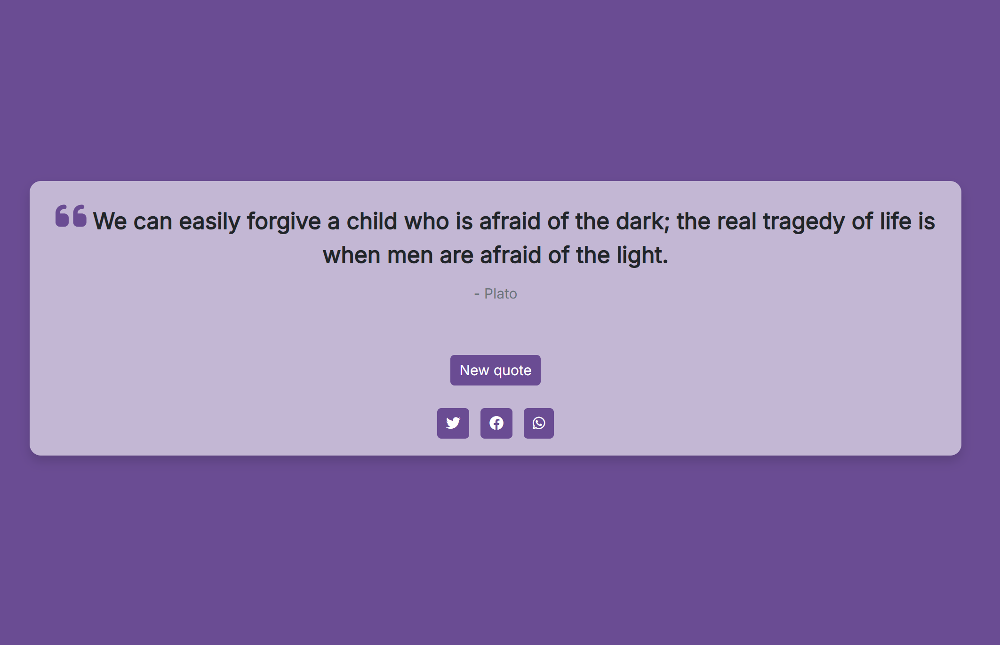

# Random Quote Machine

🔗 **Live Demo**: [https://fedelearnstocode.github.io/Random-quote-machine/](https://fedelearnstocode.github.io/Random-quote-machine/)  

A simple random quote generator built with **React** and **Bootstrap**.  
This project was developed as part of the [FreeCodeCamp Front End Libraries Certification](https://www.freecodecamp.org/learn/front-end-development-libraries/#front-end-development-libraries-projects).

## 🛠 Features

- Random quote selection from a predefined array.
- Dynamic background and button color changes.
- Quote sharing options:
  - 🐦 Twitter
  - 📘 Facebook
  - 💬 WhatsApp
- Responsive and accessible interface.

## 💡 Technical Notes

Initially, the project used an external API for quotes, but due to **CORS policy** issues, I decided to use the official FreeCodeCamp quote JSON file, which is more stable and compatible with the platform's automatic testing.

## 📦 Technologies Used

- [React (via CDN)](https://reactjs.org/)
- [Bootstrap 5](https://getbootstrap.com/)
- [FreeCodeCamp Quote JSON](https://gist.githubusercontent.com/camperbot/5a022b72e96c4c9585c32bf6a75f62d9/raw/e3c6895ce42069f0ee7e991229064f167fe8ccdc/quotes.json)

---

🎓 Built for the **Random Quote Machine** project by [FreeCodeCamp](https://www.freecodecamp.org/).
